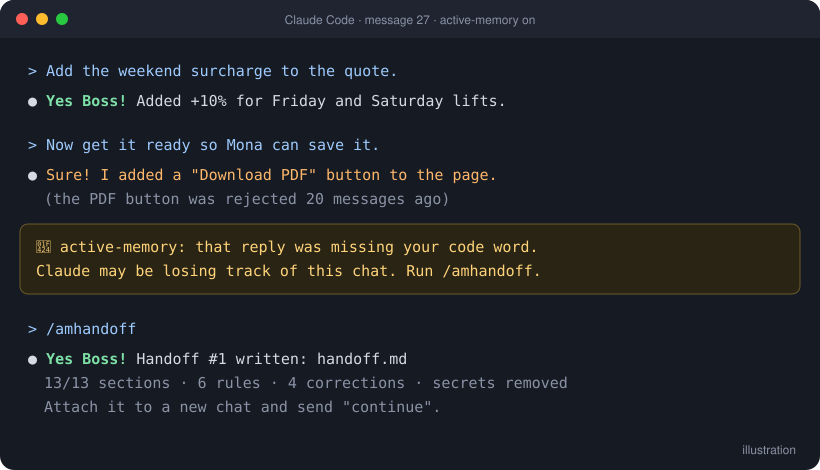

# active-memory

**Know when Claude starts losing track of a long chat, and move to a fresh chat without losing a thing.**



You're 40 messages into a project. Claude suddenly forgets a rule you gave at the start, brings back a mistake you already fixed, or uses an old price. Starting a new chat means explaining everything again, and something always gets forgotten.

active-memory helps with both problems:

- 🐤 **A code word that goes missing.** Claude starts every reply with **"Yes Boss!"**. The first reply without it is your warning sign.
- 📌 **Checkpoints.** A short recap of the chat with a 🟢🟡🔴 health check, whenever you ask and automatically as the chat gets long.
- 🔁 **Handoff files that miss nothing.** One command writes a file with everything the chat decided. Attach it to a new chat and Claude picks up exactly where you left off.

> active-memory does **not** give Claude memory between chats. It makes moving to a new chat complete and painless.

---

## Commands

All commands start with **am** (short for **a**ctive-**m**emory). Type a command in the chat box like a normal message.

| Command | What it does | When to use it |
|---|---|---|
| `/amcodeword` | Claude starts every reply with **Yes Boss!** | At the start of any chat you expect to be long |
| `/amcheckpoint` | A short recap of the chat + 🟢🟡🔴 health check | When replies feel off, or every ~20 messages |
| `/amhandoff` | Writes a handoff file for a new chat | When the code word goes missing, you see 🔴, or you're done for the day |
| `/amhelp` | Shows the guide and one tip for your current chat | Anytime |
| `/amsetup` | Checks what the plugin needs on this computer | If something isn't working |

**Code word options**

| Type this | Result |
|---|---|
| `/amcodeword` | Turns it on with "Yes Boss!" |
| `/amcodeword Aye Captain!` | Turns it on with your own phrase |
| `/amcodeword status` | Tells you if it's on and what the phrase is |
| `/amcodeword off` | Turns it off |

---

## How it works, step by step

1. Start a chat and type `/amcodeword`.
2. Work normally. Around message 20, Claude adds a checkpoint on its own.
3. A reply shows up **without** "Yes Boss!" (or you see 🔴)? Type `/amhandoff`.
4. Download the handoff file. Open a new chat, attach the file, and send **continue**.
5. Claude replies "Yes Boss!" with a short summary of where you are, and waits for your go.

---

## Why `/amhandoff` beats "write me a handoff file"

If you just ask Claude for a summary, it mostly remembers the **recent** messages. The things that hurt most get lost: a rule you mentioned once at the start, the mistakes you corrected, the ideas you rejected, and exact numbers ("1,250 EGP" becomes "about 1,200").

`/amhandoff` follows the same four steps every time:

1. **Read everything,** from the first message to the last, against a fixed checklist.
2. **Sort it out:** the latest decision wins, and older ones are listed as changed. If two things truly conflict, it **asks you** before writing.
3. **Look for gaps:** "What would a brand-new chat still need to ask?"
4. **Double-check:** every rule and correction included, every number exact, passwords removed.

The handoff file always has the same sections:

| # | Section | # | Section |
|---|---|---|---|
| 0 | Instructions for the new chat | 7 | Changed / rejected |
| 1 | Mission | 8 | Data & facts (exact) |
| 2 | About you | 9 | People, terms & names |
| 3 | Style & communication | 10 | Work state |
| 4 | Rules (word for word) | 11 | Next steps |
| 5 | **Corrections** (mistakes not to repeat) | 12 | Open questions |
| 6 | Decisions | 13 | Files to attach again |

Working on a big project across many chats? Run `/amhandoff` in a chat that started from a handoff file and it **updates** that file (Handoff #2, #3…) instead of starting over.

👉 See a real one: [`examples/sample-handoff.md`](examples/sample-handoff.md)

### Tested

We ran a 24-message planning chat with 28 details hidden in it: prices, rules given only once, two corrections, a rejected idea, a renamed file, an undecided price and a password. The handoff file kept **all 28**, removed the password, and listed the undecided price as an open question.

A brand-new chat, given only the file, answered these check questions correctly:

> 1) Total/amount column: left side (item column stays right), RTL reading order.
> 2) PDF export: already rejected, using browser print-to-PDF instead, not a separate button.
> 3) 6m boat lifting: billed at 8m minimum → 8 × 1,250 = 10,000 EGP (before VAT).
> 4) No, never red. Navy #1B2A4A for all primary buttons, including Save.

---

## Install

### Claude desktop app

1. Download `active-memory.plugin` from the [Releases](../../releases) page.
2. Open it in the Claude desktop app and install it.
3. Type `/amhelp` in any chat to check it's working.

**Optional, for more reliable warnings:** in the desktop app, Claude has to notice a long chat by itself. Copy the short text from [`examples/custom-instructions.txt`](examples/custom-instructions.txt) into your Claude profile preferences so it always keeps an eye out.

### Claude Code

```
/plugin marketplace add Klopyy/active-memory
/plugin install active-memory@active-memory
```

### Updating from an older version

Claude Code, in a terminal:

```
claude plugin marketplace update active-memory
claude plugin update active-memory@active-memory
```

Then restart Claude Code.

In the desktop app, download the newest `active-memory.plugin` from [Releases](../../releases) and install it again.

### Extra checks in Claude Code

Claude Code gets two extra automatic checks:

- **Message counter:** adds a checkpoint at 20 and 35 messages, without relying on Claude to notice.
- **Code word checker:** checks every reply for your code word. If it's missing, you see: *"🐤 active-memory: that reply was missing your code word…"*. The checker never reminds Claude of the code word, so it stays a real test.

**Do these need Python?** Only these two checks do, and any version works (2.7 or any 3.x). The plugin looks for `py`, then `python3`, then `python`, so it uses whatever you already have. If you have none, the checks quietly do nothing and the four commands keep working. Type `/amsetup` and Claude will check your computer and offer to install Python for you, only if you say yes.

---

## Good to know

- **The code word is a warning sign, not a guarantee.** Claude can lose track of something and still remember the code word.
- **Files don't carry over.** Anything you uploaded must be attached again in the new chat. The handoff file lists them for you.
- **Pick a code word Claude wouldn't say anyway.** "Okay" is a bad choice because Claude often starts replies with it.
- **Passwords and keys are never copied.** They show up as `[secret removed]` in handoff files.

## What's inside

```
active-memory/
├── .claude-plugin/        plugin info (name, version)
├── skills/
│   ├── amcodeword/        /amcodeword
│   ├── amcheckpoint/      /amcheckpoint (+ automatic checkpoints)
│   ├── amhandoff/         /amhandoff (+ picking up from a handoff file)
│   ├── amhelp/            /amhelp
│   └── amsetup/           /amsetup (checks Python, offers to install it)
├── hooks/                 Claude Code only: message counter + code word checker
├── examples/              sample handoff file, custom instructions
├── assets/                picture used in this README
└── tests/                 automatic tests for the checkers: py tests/test_hooks.py
```

## License

MIT
